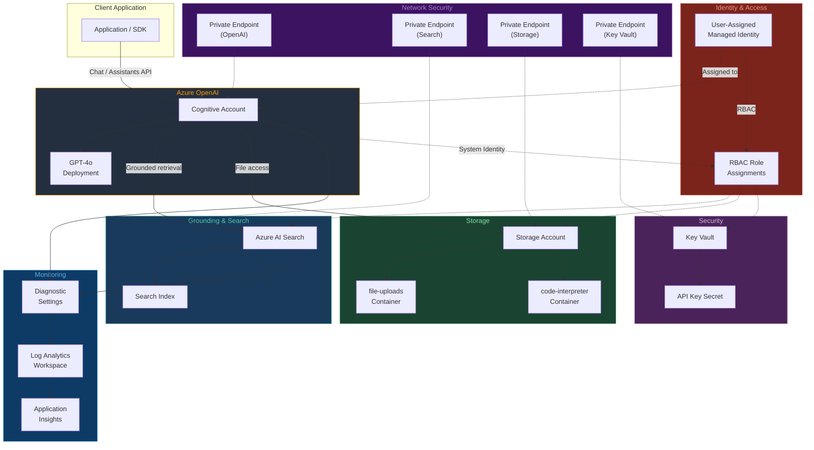

# terraform-azure-ai-agent-service

Terraform module for provisioning the **Azure AI Agent Service** infrastructure -- everything needed to build autonomous AI agents with Azure OpenAI, function calling, code interpreter, and grounded retrieval via Azure AI Search. This module creates the OpenAI account, model deployment, AI Search, storage, Key Vault, managed identity, monitoring, and optional private endpoints.

---

## Architecture



---

## Documentation

- [Azure AI Agent Service Overview](https://learn.microsoft.com/en-us/azure/ai-services/agents/overview)
- [Azure OpenAI Assistants How-To](https://learn.microsoft.com/en-us/azure/ai-services/openai/how-to/assistants)
- [Terraform azurerm_cognitive_account Resource](https://registry.terraform.io/providers/hashicorp/azurerm/latest/docs/resources/cognitive_account)

---

## Prerequisites

1. **Terraform** >= 1.5.0
2. **AzureRM Provider** >= 3.90.0
3. **Azure CLI** authenticated with `az login` and a subscription selected.
4. A **resource group** already created in the target subscription and region.
5. **Azure OpenAI access** approved for your subscription (apply at [https://aka.ms/oai/access](https://aka.ms/oai/access) if not yet approved).
6. The target region must support Azure OpenAI and the chosen model (check [regional availability](https://learn.microsoft.com/en-us/azure/ai-services/openai/concepts/models#model-summary-table-and-region-availability)).
7. If enabling private endpoints, a virtual network and subnet must exist in the same region.

---

## Usage Example

```hcl
provider "azurerm" {
  features {
    key_vault {
      purge_soft_delete_on_destroy = false
    }
  }
}

resource "azurerm_resource_group" "this" {
  name     = "rg-ai-agents-prod"
  location = "eastus2"
}

module "ai_agent" {
  source = "github.com/kogunlowo123/terraform-azure-ai-agent-service"

  name_prefix         = "myagent-prod"
  location            = azurerm_resource_group.this.location
  resource_group_name = azurerm_resource_group.this.name

  # OpenAI configuration
  openai_sku     = "S0"
  model_name     = "gpt-4o"
  model_version  = "2024-05-13"
  model_capacity = 30

  # Search
  search_service_sku = "basic"

  # Storage
  storage_account_tier = "Standard"

  # Monitoring
  enable_monitoring = true

  # Network (optional)
  enable_private_endpoints   = false
  allowed_ip_ranges          = []

  tags = {
    Environment = "production"
    Team        = "ai-platform"
    ManagedBy   = "terraform"
  }
}

output "openai_endpoint" {
  value = module.ai_agent.openai_endpoint
}

output "search_endpoint" {
  value = module.ai_agent.search_service_endpoint
}
```

---

## Deployment Guide

### Step 1 -- Prepare the Environment

```bash
git clone https://github.com/kogunlowo123/terraform-azure-ai-agent-service.git
cd terraform-azure-ai-agent-service

az login
az account set --subscription "<your-subscription-id>"
```

### Step 2 -- Verify Azure OpenAI Access

Confirm that your subscription has Azure OpenAI access approved:

```bash
az cognitiveservices account list-kinds | grep OpenAI
```

### Step 3 -- Create a Terraform Configuration

Create a `main.tf` in your working directory that calls this module (see the usage example above). Ensure the resource group exists or is created alongside the module call.

### Step 4 -- Initialize and Plan

```bash
terraform init
terraform plan -out=tfplan
```

Review the plan to confirm all resources, RBAC assignments, and optional components match your expectations.

### Step 5 -- Apply

```bash
terraform apply tfplan
```

### Step 6 -- Verify the Deployment

```bash
# Check the OpenAI endpoint
az cognitiveservices account show \
  --name <name_prefix>-openai \
  --resource-group <resource_group_name> \
  --query "properties.endpoint" -o tsv

# List model deployments
az cognitiveservices account deployment list \
  --name <name_prefix>-openai \
  --resource-group <resource_group_name> \
  -o table
```

### Step 7 -- Test the Agent API

Use the Azure OpenAI Assistants API to create and test an agent:

```python
from openai import AzureOpenAI

client = AzureOpenAI(
    azure_endpoint="<openai_endpoint>",
    api_key="<api_key>",  # or use DefaultAzureCredential
    api_version="2024-05-01-preview",
)

assistant = client.beta.assistants.create(
    name="Test Agent",
    instructions="You are a helpful assistant.",
    model="gpt-4o",
    tools=[{"type": "code_interpreter"}],
)

thread = client.beta.threads.create()
message = client.beta.threads.messages.create(
    thread_id=thread.id,
    role="user",
    content="Write a Python function that calculates fibonacci numbers.",
)

run = client.beta.threads.runs.create_and_poll(
    thread_id=thread.id,
    assistant_id=assistant.id,
)

messages = client.beta.threads.messages.list(thread_id=thread.id)
print(messages.data[0].content[0].text.value)
```

### Step 8 -- Enable Private Endpoints (optional)

If you need network isolation, set `enable_private_endpoints = true` and provide the `private_endpoint_subnet_id`. Re-run `terraform plan` and `terraform apply`.

---

## Inputs

| Name | Description | Type | Default | Required |
|------|-------------|------|---------|----------|
| `name_prefix` | Prefix for naming all resources | `string` | n/a | yes |
| `location` | Azure region | `string` | n/a | yes |
| `resource_group_name` | Resource group name | `string` | n/a | yes |
| `openai_sku` | SKU for Azure OpenAI | `string` | `"S0"` | no |
| `model_name` | Model to deploy | `string` | `"gpt-4o"` | no |
| `model_version` | Model version | `string` | `"2024-05-13"` | no |
| `model_capacity` | TPM capacity (thousands) | `number` | `30` | no |
| `search_service_sku` | Azure AI Search SKU | `string` | `"basic"` | no |
| `storage_account_tier` | Storage performance tier | `string` | `"Standard"` | no |
| `enable_private_endpoints` | Enable private endpoints | `bool` | `false` | no |
| `enable_monitoring` | Enable Application Insights | `bool` | `true` | no |
| `allowed_ip_ranges` | IP CIDR ranges for OpenAI access | `list(string)` | `[]` | no |
| `tags` | Tags for all resources | `map(string)` | `{}` | no |
| `key_vault_sku` | Key Vault SKU | `string` | `"standard"` | no |
| `key_vault_purge_protection` | Enable purge protection | `bool` | `true` | no |
| `key_vault_soft_delete_retention` | Soft delete retention days | `number` | `90` | no |
| `storage_replication_type` | Storage replication type | `string` | `"LRS"` | no |
| `log_analytics_retention_days` | Log retention days | `number` | `30` | no |
| `virtual_network_id` | VNet ID for private endpoints | `string` | `""` | no |
| `private_endpoint_subnet_id` | Subnet ID for private endpoints | `string` | `""` | no |

## Outputs

| Name | Description |
|------|-------------|
| `openai_endpoint` | Azure OpenAI service endpoint URL |
| `openai_id` | Resource ID of the OpenAI Cognitive Account |
| `search_service_id` | Resource ID of the AI Search service |
| `search_service_endpoint` | Endpoint URL of the AI Search service |
| `storage_account_id` | Resource ID of the storage account |
| `key_vault_id` | Resource ID of the Key Vault |
| `identity_id` | Resource ID of the user-assigned managed identity |
| `application_insights_id` | Resource ID of Application Insights (if enabled) |
| `openai_principal_id` | System-assigned principal ID of the OpenAI account |
| `identity_principal_id` | Principal ID of the managed identity |
| `identity_client_id` | Client ID of the managed identity |
| `log_analytics_workspace_id` | Resource ID of the Log Analytics workspace |
| `storage_account_name` | Name of the storage account |
| `key_vault_uri` | URI of the Key Vault |
| `model_deployment_name` | Name of the deployed model |
| `application_insights_connection_string` | App Insights connection string (sensitive, if enabled) |

---

## License

MIT License. See [LICENSE](LICENSE) for details.
